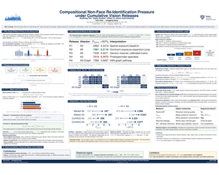

# ECCV 2026 poster — paper 6474

Source and build for the conference poster accompanying *Compositional Non-Face
Re-Identification Pressure under Cumulative Vision Releases* (Tirth Joshi,
Honggang Wang — Katz School of Science and Health, Yeshiva University), presented
at ECCV 2026 in Malmö.



The poster is 1400 × 1000 mm, built in LaTeX, and goes to the conference printer
as a single print-ready PDF. Everything here builds that file from scratch.

## What's in here

| | |
|---|---|
| `ECCV_2026_Poster_Tirth_Joshi.tex` | the poster itself — all layout and copy |
| `assets/fig_release_trends_vector.tex` | §5 heatmaps (P_guess and vRPI₂ across releases) |
| `assets/fig_replication_vector.tex` | §6 dumbbell panels (CUHK03-τ replication) |
| `assets/*.pdf`, `assets/*.svg` | ECCV and Katz School logos, converted to CMYK |
| `build.ps1` | compile + run every print check + produce the deliverable |
| `check_margins.py` | verifies content clears the trim box (called by the build) |
| `make_pngs.py` | renders the display PNGs from the print PDF |
| `6474_Joshi_1400x1000mm.pdf` | **the file that goes to the printer** |
| `poster.png`, `poster-thumbnail.png` | display renders for the conference site |
| `BUILD_NOTES.md` | working notes, including the data cross-checks against the paper |

## Building

Needs a TeX distribution with `tcolorbox`, `pgfplots` and `tikz` (MiKTeX or TeX
Live), plus Python with Pillow for the margin check.

```powershell
.\build.ps1
```

That compiles twice, runs the checks below, and writes
`6474_Joshi_1400x1000mm.pdf`. It exits non-zero and prints `FAIL` lines if
anything is wrong, so it's safe to trust the exit code.

To regenerate the display images afterwards:

```powershell
python make_pngs.py
```

Use **pdfLaTeX** if you build by hand. Not XeLaTeX or LuaLaTeX — the TrimBox and
BleedBox are set with `\pdfpageattr`, which is pdfTeX-specific, and you'd lose
them silently.

## What the build checks, and why

Most of these exist because something went wrong first.

- **Page geometry** — MediaBox 1430 × 1030 mm, TrimBox 1400 × 1000 mm, BleedBox
  1420 × 1020 mm. Without an explicit TrimBox a preflight reads the page as
  1430 × 1030 and an automated "fit to ordered size" step quietly rescales the
  whole file by −2.1 %.
- **Crop marks** at all four corners, sitting outside the bleed.
- **Content clears the trim box by ≥ 5 mm on every side.** This one was added
  late, after the footer bar was found sitting *entirely* below the trim line —
  it would have been cut off the printed poster, taking the author names and
  paper title with it. Nothing warned about it: the content frame used
  `minipage[t][\textheight][t]`, and that inner `[t]` appends `\vss`, which is
  infinitely *shrinkable* glue. It absorbed 27 mm of overflow in complete
  silence. The frame is natural-height now, so overflow raises a real error.
- **No RGB is ever painted.** The palette is defined in the `cmyk` model and the
  check looks at the decompressed content stream for `rg`/`RG` operators.
- **Fonts embedded and subsetted, no Type 3 bitmaps.** MiKTeX was quietly
  rasterising `\texttt` as an unsubsetted bitmap font at poster sizes until
  `lmodern` was loaded.
- **Raster DPI** — the Katz logo is the only bitmap left in the poster and has to
  clear 100 DPI at its placed size. Everything else is vector.
- **No overfull boxes**, and the poster is exactly one page.

## Print specification

| | |
|---|---|
| Trim size | 1400 × 1000 mm, landscape, 1:1 |
| Bleed | 10 mm, plus a 5 mm quiet zone for crop marks |
| Colour | native DeviceCMYK — no RGB paint operations, no spot colours |
| Fonts | 11, all embedded and subsetted |
| Raster content | one image (Katz logo), CMYK, 205 DPI at placed size |
| Filename | `6474_Joshi_1400x1000mm.pdf`, as the printer requires |

## Things worth knowing before editing

A handful of these cost real time, so they're written down.

**There are five font sizes and that's deliberate.** `\fsTitle` 75, `\fsHone` 40,
`\fsHtwo` 30, `\fsBody` 25, `\fsSmall` 20, plus `\fsCell` 15 used only inside the
§5 heatmap cells. The poster previously had twenty near-identical sizes and
looked inconsistent for it. If something doesn't fit, change spacing, not size.

**TeX macro names cannot contain digits.** `\fsH1` and `\rx1` are invalid and
fail in genuinely confusing ways — `\rx1` silently corrupted every dumbbell
coordinate, and `\fsH1` pushed the whole poster onto a second page.

**Widening a figure makes its text smaller.** The figures sit inside
`\resizebox{0.94\linewidth}{!}{...}`, so growing the picture in TikZ units just
scales the whole thing back down. If a figure needs more room internally, take it
from somewhere else in the same picture.

**Watch for unscoped font switches.** `\tablefont` was being issued before a
table without a group around it, so it leaked into the rest of the section and
the Limitations block silently rendered 5 pt smaller than everything near it.

**Paragraph spacing has to be set inside the font group.** Block macros end their
content with `\par` *inside* the group and reset both `\spaceskip` and
`\xspaceskip`. Without that, TeX takes interline glue from the enclosing
`\normalsize` and body text renders at 93 pt leading instead of 44.

**The math extension font needed unfreezing.** `lmodern` declares its OMX shape
at a fixed 10 pt design size, so at poster scale `\widetilde`, `\widehat`,
`\big(` and fraction rules printed as 0.1 mm hairlines — the tilde on `X̃`
effectively vanished, which would have left column 1 reading "the non-face view
X = τ(X)". There's a `\DeclareFontShape` override near the top of the preamble
that fixes it. Don't remove it.

**Render it and look at it.** Nearly every real defect in this poster was caught
by rendering a PNG and looking, never by the check suite — a missing axis tick
label, one plot panel overprinting another, values sitting against the wrong row.
pgfplots emits one continuous picture, so TeX's overfull warnings never fire on
overlapping graphics. The checks are necessary but they are not sufficient.

## Data

Every number on the poster is taken from the paper and was checked against it
cell by cell: the main results against table `tab:exp_means`, the replication
against `tab:cuhk_replication`, and the diagnostics against the prose in the
experiments section. The cross-check tables are in `BUILD_NOTES.md`.

One thing that reads oddly at first glance: blank cells in the §5 heatmaps mean
the paper reports **no value** for that attacker at that release stage, not zero.
A₀, A₁, A₃ and A₄ have no R4 row, and A₂ and A₀-Graph exist only at R4. The
caption says so, but it's the first thing people ask about.

## Still open

- The PDF is native CMYK but carries no FOGRA 39 ICC output intent. Most printers
  accept untagged DeviceCMYK; worth confirming rather than assuming.
- Thirteen unused `/DeviceRGB` references survive in the file — pgf shading
  templates that `tcolorbox`'s `enhanced` skin declares whether or not you use
  them. Nothing paints with them (zero `sh` operators), so separation is
  unaffected, but a strict preflight might mention it.
- No QR code. `\paperurl` is empty; set it and rebuild if one is wanted.

## Paper

> Tirth Joshi and Honggang Wang. *Compositional Non-Face Re-Identification
> Pressure under Cumulative Vision Releases.* ECCV 2026.

The poster covers the release-as-channel formulation, the vRPI_α index built on
Arimoto conditional Rényi entropy, the monotonicity and guessing-bound theorems,
and the Market-1501-τ and CUHK03-τ experiments.
